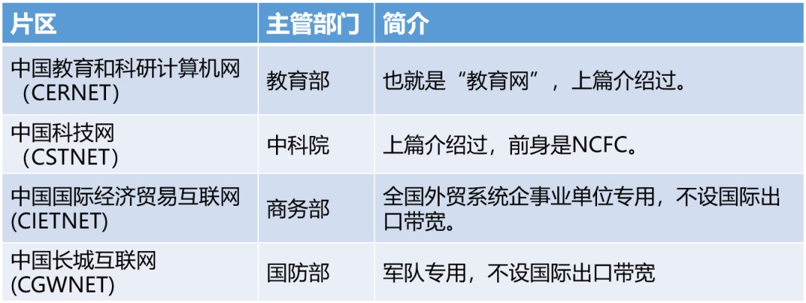

# 中国网络拓扑结构

## 国内骨干网

* 中国骨干网

  * 运营商：电信网(CHINANET)、联通网（UNINET）、网通网(CNCNET)、移动网(CMNET)等

    

  * 其他：金桥网(CHINAGBN)、**教育网(CERNET)**等

    

    * 教育网10个骨干节点

  * 骨干网本网的节点间相互连接

* 骨干网络层级

  * 运营商：骨干节点——一干（省级）——二干（地市级）——MAN——接入网（各小区、单位）
    * 各大网站通常都放置在一干、二干接入的专门的IDC（互联网数据中心，Internet Data Center）机房中，具备公网IP，且传输节点少，延时低速度快
  * 教育网：骨干节点——一干（主要高校、科研单位）——二干（较小高校）

> 具体剖析：以 CHINANET 为例
>
> 
>
> * 核心层
> * 汇接层
> * 接入层

## 骨干网的互联

* ISP 之间往往会在核心机房出连接，进行流量交换

> 中国电信、中国联通和中国移动三大运营商以及中国教育和科研计算机网、中国科技网、中国国际经济贸易互联网、中国长城互联网等公益性网络无需向任何其他运营商支付网间结算费用

